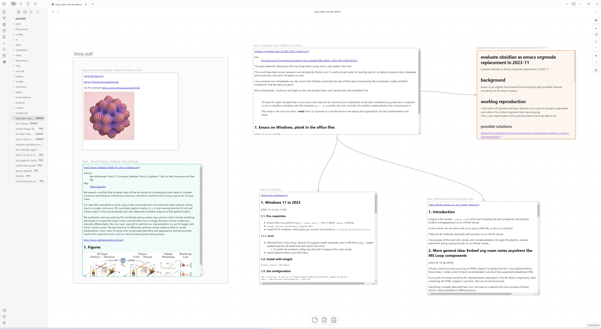

# org-roam-canvas

Render Emacs org-roam nodes on your Obsidian Canvas!

This is a FastAPI server which talks to a running Emacs process via `emacsclient` and offers the following endpoints:

- http://localhost:3813/select/ - pop up Emacs so that user can select org-roam node, then show the node detail (HTML) link which user can drag-and-drop onto the obsidian canvas
- http://localhost:3813/node/?id=NODE_ID - abovementioned node detail link which returns HTML version of the org-roam node. This is embedded by Obsidian
- http://localhost:3813/orc-files/FULL_FILE_PATH - links are rewritten so that rendered and embedded HTML nodes can load attachments
- http://localhost:3813/os-open/?filename=FULL_FILE_PATH - so that embedded HTML nodes can link back to the source files. When clicked, system will open org file with registered app, which should be Emacs

In other words:

1. Click on the select link above
2. Select and org-roam node
3. Drag and drop the offered link onto the Obsidian canvas and see the rendered note

## Screenshot(s)



## DEPRECATED prototype: backend and canvas rendering frontend

This started as a half-working prototype for serving HTML exports of org-roam nodes so that the frontend can show them on an infinite canvas.

What worked:

- fastapi backend talking to emacs via emacsclient
- frontend to render HTML versions of org-roam nodes on an infinite canvas

### Development setup

During development, we

```shell
fnm use 18
cd fe
pnpm install
pnpm run dev
# in another terminal
poetry run uvicorn serve:app --reload
```

## Dev notes

### 2023-06-04

- switched to pnpm because unlike npm, it does not mind the symlinked `node_modules`

### 2023-05-29

- fixed emacs comms and factored out (see emacsclient quoted values) note below
- managed to create an unfilled org-mode note via UI

### emacsclient returns quoted return values :(

After spending too many hours debugging / trying to work around this, I run into
this fix: https://github.com/grettke/ebse

Unfortunately, it has to run a new emacs server from batch mode. At least it has
some verbose explanation of what I'm seeing.

Use emacsclient to pipe to emacs for unquoting, but also a pattern to dump json!
https://www.reddit.com/r/emacs/comments/asil1y/batch_processing_and_printing_to_stdout_using/

I had to modify that (left comment on the reddit) to get it working on Emacs 29:

```shell
emacsclient --eval '(princ "foo\n")' | emacs -Q --batch --eval '(progn (insert-file-contents "/dev/stdin" nil nil 65536) (princ (read (buffer-string))))'
```

note the 65536 value for `END`, else it errors out with "Maximum buffer size exceeded"

### switch to org-roam node via emacsclient

```shell
# this will return the node objects representation
emacsclient -c -eval '(progn (org-roam-node-find)(org-roam-node-at-point))'
```

```lisp
(cl-defstruct (org-roam-node (:constructor org-roam-node-create)
                             (:copier nil))
  "A heading or top level file with an assigned ID property."
  file file-title file-hash file-atime file-mtime
  id level point todo priority scheduled deadline title properties olp
  tags aliases refs)
```

```shell
# spit out id, title, file
emacsclient -c -eval '(progn  (org-roam-node-find) (let ((node (org-roam-node-at-point))) (format "id:%s\ntitle:%s\nfile:%s" (org-roam-node-id node) (org-roam-node-title node) (org-roam-node-file node))))'
```

### return html version of org-roam node

```lisp
;; if heading then export subtree only (SUBTREEP), else export buffer
;; body-only does not render the title, which is why we do the whole thing, then extract the body instead
(let ((fnpos (org-roam-id-find "31dbd0e2-e881-4240-917a-2468cb23a5b5")))
  (when fnpos
    (with-temp-buffer
      (insert-file-contents (car fnpos))
      (goto-char (cdr fnpos))
      (let* ((node (org-roam-node-at-point))
             (html (org-export-as 'html (org-at-heading-p) nil nil))
             (start (cl-search "<body>" html))
             (end (cl-search "</body>" html))
             (body (substring html (+ start 6) end)))
        (format "title:%s
file:%s
%s" (org-roam-node-title node) (org-roam-node-file node) body)
        ))))
```

### react-embed looks pretty amazing

https://codesandbox.io/s/red-fog-umlic?file=/src/App.js

... but youtube refuses to render over here. See BUG below.

### dragging / moving / resizing

- https://github.com/react-grid-layout/react-draggable
- https://github.com/react-grid-layout/react-resizable
- https://github.com/bokuweb/react-rnd combines the two top
- you can manually combine them as well, simply replace Resizable with
  ResizableBox in https://codesandbox.io/s/red-fog-umlic?file=/src/App.js
- https://github.com/pveyes/htmr for rendering HTML

## bugs

### BUG: react-embed youtube briefly shows and then disappears

based on errors in my console:

- https://stackoverflow.com/questions/27573017/failed-to-execute-postmessage-on-domwindow-https-www-youtube-com-http
- https://stackoverflow.com/questions/47833687/youtube-api-failed-to-execute-postmessage-on-domwindow
- https://github.com/tjallingt/react-youtube/issues/85
- https://github.com/gajus/youtube-player/issues/15

On react-youtube issues they claim that this does not affect the appearance of
the widget, but on my side it does.

With `mkcert` I installed locally trusted certs, but even with https://localhost
access, still the same postmessage error, on no youtube video that appears.

Using the underlying https://github.com/tjallingt/react-youtube directly gives
the same behaviour.

Embedding of e.g. `<Embed url={"https://soundcloud.com/kink/mechtaya"} />` does work.
