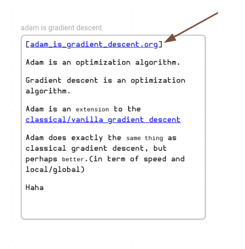

# org-roam-canvas

Render Emacs org-roam nodes on your Obsidian Canvas!

## Screenshot(s)

This is the Obsidian canvas, showing a single markdown file (yellow) and five Emacs Orgmode / Org-roam nodes:


## How it works

This is a FastAPI server which talks to a running Emacs process via `emacsclient` and offers the following endpoints:

- <http://localhost:3813/select/> - pop up Emacs so that user can select org-roam node, then show the node detail (HTML) link which user can drag-and-drop onto the obsidian canvas
- <http://localhost:3813/node/?id=NODE_ID> - abovementioned node detail link which returns HTML version of the org-roam node. This is embedded by Obsidian
- <http://localhost:3813/orc-files/FULL_FILE_PATH> - links are rewritten so that rendered and embedded HTML nodes can load attachments
- <http://localhost:3813/os-open/?filename=FULL_FILE_PATH> - so that embedded HTML nodes can link back to the source files. When clicked, system will open org file with registered app, which should be Emacs

You will typically only interact with the first `/select/` endpoint, the rest are used by Obsidian.

## How to install and run the server

### Option 1: The easy way, with pipx

Ensure you have [pipx](https://github.com/pypa/pipx) installed, and then:

```shell
# install org-roam-canvas (once)
pipx install git+https://github.com/cpbotha/org-roam-canvas.git
# now start the server
orserve
```

### Option 2: The source-checkout way

Ensure that you have [poetry](https://python-poetry.org/) installed, and then:

0. Get the source code: `git clone https://github.com/cpbotha/org-roam-canvas.git`
1. Create venv, install deps: `cd org-roam-canvas && poetry install`
2. Start the server: `poetry run orserve`

## How to use it

1. Click on the select link above
2. Select and org-roam node
3. Drag and drop the offered link onto the Obsidian canvas and see the rendered note

... alternatively, use the `ors-get-link` method from the next section.

### Pro-tip: Emacs lisp to get link

Instead of using the `select` link above, you can also just add the following function to your `init.el` and invoke it with the org-roam node open that you would like to embed. If successful, it will copy the link to your clipboard so that you can Ctrl/Cmd-V on the Obsidian Canvas.

This works for file and heading nodes.

```lisp
(defun ors-get-link()
    "Get org-roam-canvas link to org-roam node containing point. After invoking this, Ctrl-V on the Obsidian Canvas."
    (interactive)
    (let ((node (org-roam-node-at-point)))
      (if node
          (progn
            (message "Placed org-roam-canvas link on clipboard for node: %s" (org-roam-node-title node))
            (kill-new (url-encode-url (format "http://localhost:3813/node/?id=%s" (org-roam-node-id node)))))
        (message "No org-roam node found."))))
```

The following screen capture shows `ors-get-link` in action:

<video src="https://github.com/cpbotha/org-roam-canvas/assets/937871/3aeae786-5c0b-44ab-b7da-8067908c909f"></video>

## Open file in emacs

Click on the `[name_of_file.org]` link at the top of the embedded page:



## DEPRECATED prototype: backend and canvas rendering frontend

This started as a half-working prototype for serving HTML exports of org-roam nodes so that the frontend can show them on an infinite canvas.

What worked:

- fastapi backend talking to emacs via emacsclient
- frontend to render HTML versions of org-roam nodes on an infinite canvas

### DEPRECATED Development setup

During development, we

```shell
fnm use 18
cd fe
pnpm install
pnpm run dev
# in another terminal
poetry run uvicorn serve:app --reload
```
